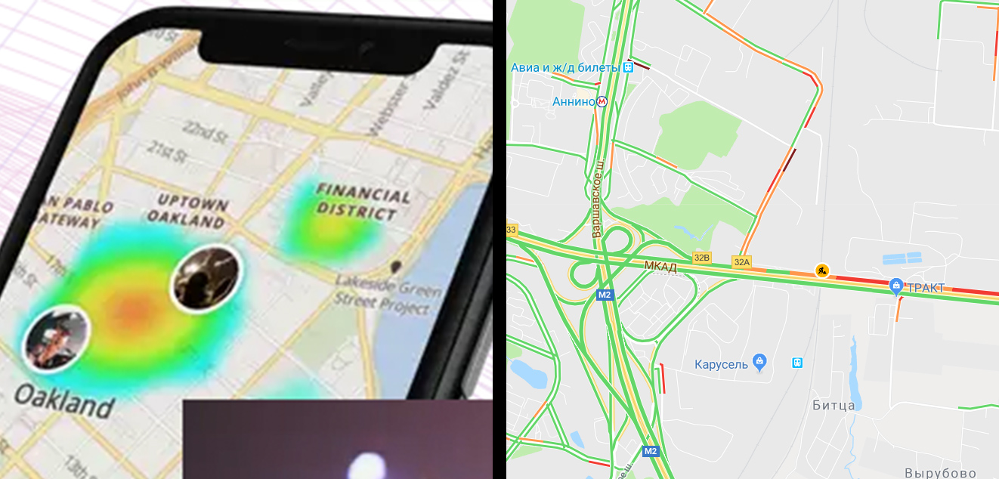

# challenge 20190719

## Brief

Need to create an application to help city administration to clean the streets of their city.\
There should be two main features:
1. There should be an apportunity for user to enter an information about pollution.
2. Map view to show polluted regions with some colored clouds or just like a trafic in navigation app.

## Objectives

Research for tools you will be using in this tasks.\
Demonstrate mastering of the basic algorithms of work in the company, skills in using the tools adopted in the company, in accordance with its guidelines.\
And, of course, get a working application according to the brief.\
The design does not matter, but the usability of your application matters.

## Rules

### Stuff

The choice of technology stack to use is completely up to you.\
You may request all you need from Client (CEO) separately from other participants in ***slack*** dm.\
Bold and custom solutions are welcome and will be evaluated separately.

### Timing

The challenge begins on ***19.07.2019*** and ends on ***09.08.2019***.\
It is allowed to use no more than ***5 working hours*** per week and no more than ***15 working hours*** in total.

### Code

1. Make a fork of this repo to ***you own*** Messapps context.
2. Do the work in your folder according ***gitflow***.
3. Make ***pull request*** to this repo no later than the end of the challenge.

### Tasks tracking

At first you should schedule tasks and make a rough estimate of the dates for them in your ***wrike*** project.

## Evaluation

Evaluation will occur by open voting.\
All voters will be divided into groups:
1. Clients (CEO & PMs)
2. Testers
3. Participants
4. Others

Each voter will have to make a rating of applications and for each of them make two lists of comments - what he/she liked and what he/she didn’t like in the application compared to the other proposed implementation variants.\
And so we got four nominations.

## Winner

The winner will have to provide a compiled version of the most successful solutions of all options in one application.